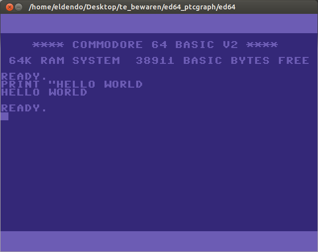

# ED64
A tutorial about writing a Commodore 64 Emulator (and a c64 emulator)

[Chapter1](./ed64Chap1/ed64Chap1.html)  

for Chapter 2 to 9 see https://web.archive.org/web/20080112195019/http://ed64.eldendo.be/  

Chapter 10 has already been moved here...  
  
In time I will clean up things and transfer all code to github  

